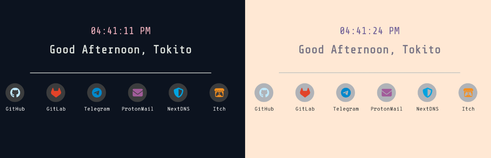

# Screenshot of this startpage



## Main features
- Light/Dark Mode
- Time-based greeting
- Built-in search integration: (DuckDuckGO)
    - __When focused on the search bar__:
        - Press `Enter` to search
- Quick access to your favorite websites
- Now Completly Local i.e fonts and icons are packed within the extension
---

# Set Custom Startpage As New Tab Page <a name="set-startpage"></a>

## Build & Sign The Extension for Firefox (Locally)

I use Mozilla's `web-ext` to build and sign my startpage extensions.

- Please note that this is **not the only way** to set my startpages as a new
  tab page. There are extensions out there, like [New Tab
  Override](https://addons.mozilla.org/en-US/firefox/addon/new-tab-override/)
  that could help you customize your New Tab page, and are browser-agnostic.

- Any modifications you make to the startpages won't take effect unless the
  extension is rebuilt.

### Prerequisites
- [web-ext](https://github.com/mozilla/web-ext)

Install from NPM:
```bash
npm install --global web-ext
```
**Note:** Archlinux Has `web-ext` in AUR

### Building The Extension
In your terminal:

1. Clone the repository:
```
git clone https://github.com/Kurumi-Tokito/startpage.git
```

2. Navigate inside the __src__ directory of your desired startpage.
```
cd src
```

4. Build the extension (Temporary addon)
```bash
web-ext build
```
- If all goes well, you will discover that a new
directory, `web-ext-artifacts` has appeared, and it contains a `.zip` file

5. Test the extension
```bash
web-ext run
```

- for more information on how to use the temporary addon
[Read This Guide By Mozilla](https://extensionworkshop.com/documentation/develop/temporary-installation-in-firefox/)

### Signing The Extension
1. Sign the extension
```bash
web-ext sign --api-key=$AMO_JWT_ISSUER --api-secret=$AMO_JWT_SECRET
```

For more information on how to obtain your `api-key` and `api-secret`, [read
this guide by
Mozilla.](https://extensionworkshop.com/documentation/develop/getting-started-with-web-ext/)
Signing an extension is talked about under _"Signing your extension for
self-distribution"_.

If all goes well during the signing process, you will discover that a new
directory, `web-ext-artifacts` has appeared, and it contains a `.xpi` file.

2. Open Firefox, type `about:addons` in the search bar and drag & drop the
   `.xpi` file into the window.

3. Firefox will now prompt you to add the extension, click `Add`

You're good to go, the custom startpage will now appear every time you open up a new tab page and homepage.
